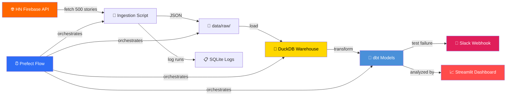

# 📊 Modern Data Stack — Hacker News Pipeline

An end-to-end data engineering portfolio project that demonstrates a **modern data stack** architecture: ingesting data from the [Hacker News API](https://hacker-news.firebaseio.com/v0/), warehousing it in **DuckDB**, transforming with **dbt**, and orchestrating with **Prefect 2**.

---

## 🏗️ Architecture



---

## 🛠️ Tech Stack

| Layer | Technology | Purpose |
|-------|-----------|---------|
| **Ingestion** | Python + `requests` | Fetch HN stories via Firebase API |
| **Storage** | JSON files | Raw landing zone |
| **Warehouse** | DuckDB | Analytical database (OLAP) |
| **Transform** | dbt + dbt-duckdb | SQL‑based data modeling |
| **Orchestration** | Prefect 2 | Workflow scheduling & monitoring |
| **Dashboard** | Streamlit | Data visualization UI |
| **Alerting** | Slack Webhooks | Failure notifications |
| **Testing** | pytest | Unit tests for ingestion logic |
| **Language** | Python 3.10 | Runtime |

---

## 📁 Project Structure

```
modern_data_stack/
├── .env.example              # Environment variable template
├── .gitignore
├── requirements.txt          # Python dependencies
├── README.md
│
├── data/
│   ├── raw/                  # JSON landing zone (git-ignored)
│   ├── warehouse/            # DuckDB file (git-ignored)
│   └── logs/                 # SQLite run logs (git-ignored)
│
├── src/
│   ├── dashboard/
│   │   └── app.py            # Streamlit dashboard
│   ├── ingestion/
│   │   └── fetch_hn.py       # HN API fetcher (parallel, 500 stories)
│   ├── loading/
│   │   └── load_duckdb.py    # Raw JSON → DuckDB loader
│   └── orchestration/
│       └── pipeline.py       # Prefect flow (daily 8 AM UTC)
│
├── dbt/
│   ├── dbt_project.yml
│   ├── profiles.yml
│   └── models/
│       ├── staging/
│       │   ├── stg_stories.sql    # Clean & cast raw fields
│       │   └── schema.yml
│       └── marts/
│           ├── top_stories.sql    # Top 100 by score per day
│           ├── author_stats.sql   # Per-author aggregations
│           └── schema.yml
│
└── tests/
    └── test_ingestion.py     # pytest for ingestion parser
```

---

## 🚀 Local Setup

### Prerequisites
- Python 3.10+
- `pip` / `venv`

### 1. Clone & enter the project

```bash
git clone <your-repo-url>
cd modern_data_stack
```

### 2. Create a virtual environment

```bash
python3 -m venv .venv
source .venv/bin/activate
```

### 3. Install dependencies

```bash
pip install -r requirements.txt
```

### 4. Configure environment variables

```bash
cp .env.example .env
# Edit .env and add your Slack webhook URL (optional)
```

### 5. Run the pipeline manually

```bash
# Step-by-step
python -m src.ingestion.fetch_hn      # Fetch 500 stories → data/raw/
python -m src.loading.load_duckdb     # Load into DuckDB
cd dbt && dbt run && dbt test && cd .. # Transform & test

# Or run the full Prefect flow
python -m src.orchestration.pipeline
```

### 6. Run tests

```bash
pytest tests/ -v
```

### 7. Run the Dashboard

```bash
streamlit run src/dashboard/app.py
```

### 8. Deploy with a daily schedule

```bash
python -m src.orchestration.pipeline --serve
# Serves the flow with a cron schedule: 0 8 * * * (daily at 8 AM UTC)
```

---

## ➕ How to Add a New Data Source

Adding a new data source follows the same layered pattern:

### 1. **Ingestion** — Create a new fetcher

```bash
# Create the module
touch src/ingestion/fetch_<source>.py
```

Implement a `fetch_and_save()` function that:
- Calls the external API
- Saves raw JSON to `data/raw/<source>_YYYY-MM-DD.json`
- Logs the run to `data/logs/runs.db`

### 2. **Loading** — Create a new loader

```bash
touch src/loading/load_<source>.py
```

Implement a `load_to_duckdb()` function that:
- Reads the latest JSON from `data/raw/`
- Creates a `raw.<source>` table in DuckDB
- Uses idempotent delete‑then‑insert by date

### 3. **dbt Models** — Add staging + marts

```bash
# Staging
touch dbt/models/staging/stg_<source>.sql

# Marts (as needed)
touch dbt/models/marts/<source>_summary.sql
```

- Reference the raw table: `select * from raw.<source>`
- Add schema.yml with column descriptions and tests

### 4. **Orchestration** — Wire into the pipeline

In `src/orchestration/pipeline.py`:

```python
@task(name="fetch-<source>")
def fetch_new_source():
    from src.ingestion.fetch_<source> import fetch_and_save
    fetch_and_save()

# Add to the flow
@flow
def hn_pipeline():
    fetch_stories()
    fetch_new_source()    # ← new
    load_to_warehouse()
    run_dbt_models()
    ...
```

### 5. **Test** — Add unit tests

```bash
touch tests/test_<source>.py
```

---

## 📊 Data Models

### `stg_stories` (staging)
Cleaned HN stories with proper types. Renames `by` → `author`, converts epoch → timestamp.

### `top_stories` (mart)
Top 100 stories by score for each ingestion day. Useful for daily digests.

### `author_stats` (mart)
Per-author aggregations: post count, average score, total comments, activity date range.

---

## 📜 License

MIT
